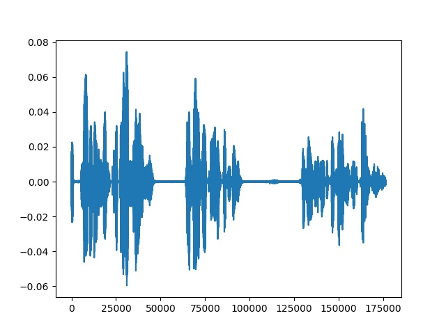
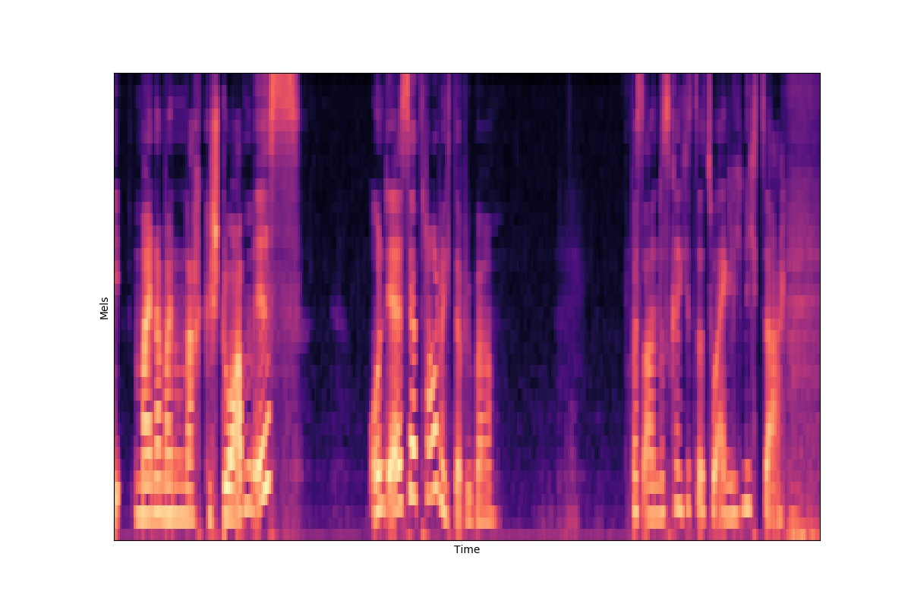

# AlcoAudio Research

Detection of Alcohol induced intoxication through voice using Neural Networks

## Table of Contents

* [About the Project](#about-the-project)
* [Dataset](#dataset)
* [Architectures](#architectures)
* [Setup](#setup--usage)
* [Usage](#usage)
  * [Data generation](#data-generation)
  * [Training the network](#training-the-network)
  * [Inference](#inference-of-the-best-model)
* [Future work](#future-work-todo)
  * [Data Representations](#improve-on-data-representations)
  * [New Architecture try outs](#try-new-architectures)
* [License](#license)
* [Acknowledgement](#acknowledgements)


## **Dataset**

[Alcohol Language Corpus](https://www.phonetik.uni-muenchen.de/Bas/BasALCeng.html) is a curation of audio samples from 162 speakers. Audio samples are first recorded when speaker is sober. Then the speakers are given a chosen amount of alcohol to reach a particular intoxication state, and audio samples are recorded again. 

Audio samples are split into 8 seconds each. Below is the plot of a raw signal

 <!-- .element height="50%" width="50% -->

These raw audio signals are converted into Mel filters using ```librosa```. Below is how it looks:

 <!-- .element height="50%" width="50% -->

## **Architectures**

Below are the architectures tried. All the files are under [networks](https://github.com/ShreeshaN/AlcoAudio/tree/master/alcoaudio/networks) folder. 


|Networks   |  Loss | UAR  |
|---|---|---|
|  [Convolutional Neural Networks](https://github.com/ShreeshaN/AlcoAudio/blob/master/alcoaudio/networks/convnet.py)(convnet) |   |   |
| [LSTM](https://github.com/ShreeshaN/AlcoAudio/blob/master/alcoaudio/networks/recurrent_net.py)(lstm)  |   |   |
| [Conv LSTMs](https://github.com/ShreeshaN/AlcoAudio/blob/master/alcoaudio/networks/crnn.py)(crnn)  |   |   |
| [One class Neural Networks](https://github.com/ShreeshaN/AlcoAudio/blob/OC_NN/alcoaudio/networks/oneclass_net.py)(ocnn)  |   |   |
| [Conv Auto Encoders](https://github.com/ShreeshaN/AlcoAudio/blob/autoencoders/alcoaudio/networks/convautoencoder_net.py)(cae)  |   |   |


## **Setup**

1. Download and run the requirements.txt to install all the dependencies.

      
        pip install -r requirements.txt
     
     
2. Create a [config](https://github.com/ShreeshaN/AlcoAudio/blob/master/alcoaudio/configs/shree_configs.json) file of your own

## Usage

###**Data generation**

Run ```data_processor.py``` to generate data required for training the model. It reads the raw audio samples, splits into ```n``` seconds and generates Mel filters, also called as Filter Banks (```fbank``` paramater in config file. Other available audio features are ```mfcc``` & ```gaf```)

    python3 data_processor.py --config_file <config_filepath>

### **Training the network**

Using ```main.py``` one can train all the architectures mentioned in the above section.

    python3 main.py --config_file <config_filepath> --network convnet
        
### **Inference**

One can use our model for inference. The best model is being saved under [best_model](alcoaudio/best_model) folder
       
    python3 main.py --config_file --test_net True <config_filepath> --network convnet --datapath <data filepath>
       
   Remember to generate mel filters from raw audio data and use the generated ```.npy``` file for datapath parameter
   

## **Future work: TODO**

### **Improve on Data Representations**

 - [ ] Work on frequency variance in voice
 - [ ] Recurrence plots
 - [ ] Extract features using Praat and Opensmile
 - [ ] Normalise audio sample based on average amplitude

### **Try new architectures**

 - [ ] Conditional Variational AutoEncoder
 - [ ] Convolutional One class Neural Network

## **License**
[MIT](https://choosealicense.com/licenses/mit/)

## **Acknowledgements**
I would like to thank [Emmanuel O. Agu](https://www.wpi.edu/people/faculty/emmanuel) for guiding our team throughout. I would also like to thank team members [Pratik](https://github.com/PRAkTIKal24), [Arjun](https://github.com/arjunrao796123) and [Mitesh]() for all their contributions.

